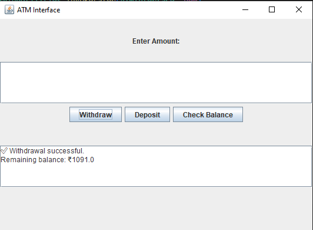

# 🏧 ATM Interface – Java GUI Project


This is a simple ATM interface built using Java and Swing. It allows users to:
- 💰 Check balance
- ➕ Deposit money
- ➖ Withdraw money

---

## 📸 Screenshot



---

## 📁 Project Structure

```text
atm_interface_java/
├── src/
│   ├── ATMInterface.java
│   └── BankAccount.java
├── Screenshot_of_game.png
├── README.md
├── LICENSE
└── .gitignore