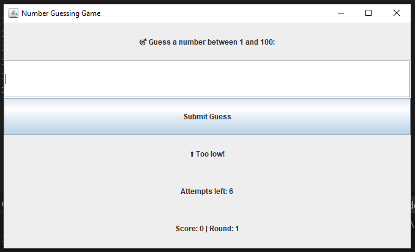

# 🎯 Number Guessing Game – Java GUI Edition

This is a fun and interactive number guessing game built using Java and Swing. The game challenges the player to guess a randomly selected number between 1 and 100 within a limited number of attempts. It’s designed as part of my project work under the **CODESOFT Internship Program**.


---

## 🖼️ Screenshot



---

### 👩‍💻 Developed by: [Vaibhavi Verma](https://github.com/Vaibhavi931)


---

## 🧩 How the Game Works

- When the game starts, a random number between 1 and 100 is generated.
- The player enters their guesses through a graphical interface.
- After each guess, feedback is provided:
  - **Too high**
  - **Too low**
  - **Correct!**
- The player has a total of 7 attempts to guess correctly.
- A score is calculated based on how many attempts are left.
- After each round, the player is given the option to play again.

---

## 🖥️ Technologies Used

- **Java** – Core language
- **Java Swing** – For building the GUI interface
- **JDK 17+** – Recommended for compiling and running

---

## 🚀 How to Run

> Make sure Java is installed on your system. You can check with:
> ```
> java -version
> ```

1. Open the terminal and navigate to the `NumberGuessingGame` folder:
   ```bash
   cd NumberGuessingGame
  